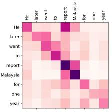

% AI Safety and Programming Languages (RASP)

# AI Safety and Programming Languages (RASP)

+ Make sure AI doesn't cause widespread damage
    * Make sure we know what kinds of AI are about to cause damage
        - Interpret the "brains" of an AI
            + Decompile AI models into human readable representations
                * Come up with a human readable representation that faithfully
                  represents current AI models: RASP!

# Objective for today

+ Understand what RASP is and at a high level how it represents transformers
+ Do the RASP exercises!

# What is a transformer

+ We are dealing with a long stream of data
+ Neural networks have a hard time focusing on things far away from each other
  in the stream
+ We want to give the neural net some way of dealing with this, hence attention
+ See
  [https://github.com/changlinli/intro-to-technical-ai-safety-slides/blob/ad11d2184f337c629fdae9591b2065228024e345/language_models/slides.md](https://github.com/changlinli/intro-to-technical-ai-safety-slides/blob/ad11d2184f337c629fdae9591b2065228024e345/language_models/slides.md)
  for overall architecture.

# Attention

But what is "attention?"

+ Brief high-level intuition here: I want to "look up" the "context" that a word
  appears in.
+ E.g. when I search on Google to understand an unfamiliar word, I have the following mental model:
    - My word gets encoded into some sort of query
    - Every webpage has some lookup key associated with it
    - Google compares my query against every webpage's lookup key, the better the
      match the more importance/the higher weight it gets
    - Every webpage also some lookup value associated with it, and that lookup
      value is extracted and weighted it by how well the query matches the lookup
      key
    - Finally I merge all the lookup values with their associated weights into a
      single result page, using the weights to decide how to display the page
+ Note technically a transformer uses "multi-head attention," which really is
  just `n` copies of a single attention mechanism. We'll talk about it more in
the attention-specific presentation.

# Abstract Sequence of Attention Operations

Let's generalize what I just did with Google.

+ Have some element
+ Encode the element as a query
+ Generate lookup keys and lookup values
+ Compare query against every key to generate "lookup weights"
+ Use lookup weights to proportionally extract lookup values
+ Combine all lookup values using some sort of merge function to generate a
  single "context" for my element

# Attention Diagram

# Translating transformers into RASP

+ Get rid of all the matrices
+ At a high level, we have two important components: attention layers and MLPs

# Attention in RASP

+ Let's cut out the matrices and just generate the attention matrix explicitly
+ Attention matrix
+ Let's jump to the example here: 

# But what about the MLPs?

+ You may know that despite "Attention is All You Need," the transformer
  architectures also has MLPs (i.e. vanilla neural nets)!
+ But we know that MLPs can approximate any mathematical function if they're
  wide enough
+ So RASP assumes arbitrary element-wise transformations

# Why are we allowed to generate the attention matrix explicitly?

+ Why are RASP attention matrices a strict subset of transformer matrices?
+ Every entry in the attention matrix is generated as the dot product of one key
  vector with one query vector
+ And then every entry in the output context vector is the 

# Output values

+ For the output value it's all just a bunch of matrix math
+ Notice that for any given vector that comes out of the value matrix
  multiplication, each entry is the sum of entries from all the other values
  multipled by the values of the row

# Key Query values

+ For equality as comparator, just look at high dot products (note that we
  have layer norm), and then multiply by a large constant (as large as you want
  to make equality "sharp") to make softmax. Note that we have layer norm so
  effectively angle between vectors is all that matters.
+ For less than as comparator (e.g. `query(a) < key(b)`), specify query and
  key matrices to individually scale each basis vector (e.g. if you have a three
  element vector, scale the first by 100, then the second by 10, and the third
  by 1.
+ For greater than as comparator, mutatis mutandis.
