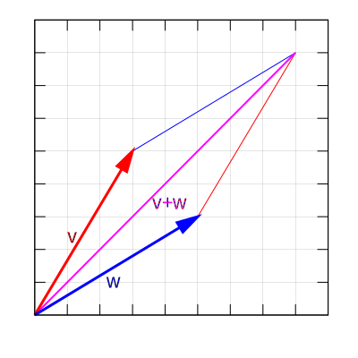

## Matrix Rank

We're going to talk about matrix rank here, because it's a concept that shows
up quite a bit in ML.

*Exercise*:

> Take the vector space $R^2$ and the subspace that consists of the set of all
> vectors $(x, y)$ such that $x$ and $y$ are equal to each other.
>
> Can you come up with a set of basis vectors for that subspace, i.e. a set of
> vectors within that subspace ? How large is that set?

<details>
<summary>Solution</summary>
This should be the same answer as from the previous exercises. The set of basis
vectors will be of size 1. One candidate for that basis vector is $(1, 1)$.
</details>

*Exercise*:

> Let's take another look at another $3 \times 2$ matrix. As is usual we'll
> assume that we are working with $R^2$ and $R^3$ and that are bases are the
> standard basis vectors.
>
> ```math
> \begin{bmatrix} 0 & 1 \\\ 1 & 0 \\\ 1 & 0 \end{bmatrix}
> ```
> As we can see from the 3 rows of the matrix, the codomain of this function has a
> dimension of three. What is the dimension of the range of this function? That
> is how many elements form a basis of its range?

<details>
<summary>Solution</summary>
The dimension of its range is 2, that is one smaller than the dimension of its
codomain.
</details>

In general it turns out that the dimension of the range of a function cannot
exceed the dimension of its domain.

<details>
<summary>Optional Exercise</summary>
Prove this.
</details>

So for example, we know that the dimension of the range of a function
represented by a $3 \times 2$ matrix cannot be equal to the dimension of its
codomain.

However, even for a square matrix, the dimension of the range of its associated
function may not be equal to its codomain.

*Exercise*:

> Let's look at the following $3 \times 3$ matrix for $R^3$ with the standard
> basis vectors:
>
> ```math
> \begin{bmatrix} 1 & 1 & 1 \\\ 1 & 1 & 1 \\\ 1 & 1 & 1 \end{bmatrix}
> ```
>
> What is the range of this function? What is the dimension of its range?

<details>
<summary>Solution</summary>
The range of this function is the set of all triplets whose components are all
equal to each other. The dimension of this is $1$.
</details>

It turns out it is often useful to know what the dimension of the range is of
the function that a matrix represents. It is useful enough that it has its own
name, the rank of a matrix. A matrix is considered "low-rank" if its rank is
less than the number of rows it has, that is the range of the associated
function is smaller than the codomain of the associated function.

*Exercise*:

> Let's say you have a real-valued matrix of size $3 \times 2$. As a reminder
> this means that this corresponds to a linear function $f$ whose domain has
> dimension $2$ and codomain has dimension $3$. Can you come up with values for
> that matrix such that its rank is less than $2$ and no value is zero?

<details>
<summary>Solution</summary>
Could fill it again with all ones!
</details>

## Matrix Multiplication

One of the most important parts of matrices is that they allow us to express
more things as computation which can be easily carried out on a computer. We've
already seen how we can treat matrices as lookup tables. Let's look again at
$R^2$ with the standard basis vectors and review the exact sequence of steps we
perform.

Given the matrix

```math
\begin{bmatrix} 0 & -1\\\ 1 & 0 \end{bmatrix}
```

and the vector

```math
(3, 2)
```

Keeping in mind again that $(3, 2) = 3 \cdot (1, 0) + 2 \cdot (0, 1)$ let's go again over the full sequence of how to compute the result.

1. $f((3, 2)) = 3\cdot f((1, 0)) + 2\cdot f((0, 1))$
2. $3\cdot f((1, 0)) + 2\cdot f((0, 1)) = 3\cdot(0\cdot (1, 0) + 1\cdot(0, 1)) + 2
   \cdot (-1 \cdot (1, 0) + 0 \cdot (0, 1))$
3. So our final result is $(0, 3) + (-2, 3) = (-2, 3)$

Let's focus some more on the second step there.

```math
3 \cdot (0\cdot (1, 0) + 1\cdot(0, 1)) + 2 \cdot (-1 \cdot (1, 0) + 0 \cdot (0, 1))
```

This is the same thing (by distributing the multiplication) as 

```math
3 \cdot 0 \cdot (1, 0) + 3 \cdot 1 \cdot (0, 1) + 2 \cdot -1 \cdot (1, 0) + 2 \cdot 0 \cdot (0, 1)
```

which in turn is the same thing (by rearranging some of the additive terms) as

```math
3 \cdot 0 \cdot (1, 0) + 2 \cdot -1 \cdot (1, 0) + 3 \cdot 1 \cdot (0, 1) + 2 \cdot 0 \cdot (0, 1)
```

Since we're using the standard basis here, this whole thing is equal to

```math
(3 \cdot 0 + 2 \cdot -1, 3 \cdot 1 + 2 \cdot 0)
```

So if we make sure that we keep the same set of basis vectors and those basis
vectors happen to be the standard basis throughout our entire computation, we
have a much more compact way of computing a linear function applied to a vector
given its matrix.

Namely take each row of the matrix, do component-wise multiplication with the
vector, then sum up that result and that's one component of the resulting
vector. In our previous example, we notice that $0$ and $-1$ are the first row
of our matrix so we multiply by $3$ and $2$ respectively and add them together
to the first component of our resulting vector and then we do the same for $1$
and $2$ as the second row of our matrix.

For people who have learned matrix multiplication rules this should look very
familiar! It might not have been apparent back then why we do multiplication
that way, but now we can see that this particular order of multiplication and
summation falls out as an inevitable consequence of how matrices represent
linear functions.

So in the special case of two-dimensional matrices we have matrix-vector
multiplication defined as 

```math
\begin{align}
M &= \begin{bmatrix} a & b \\ c & d \end{bmatrix} \\
v &= (v_0, v_1) \\
M \times v &= (av_0 + bv_1, cv_0 + dv_1)
\end{align}
```

or more generally for an $m \times n$ matrix and $n$-tuple vector:

```math
\begin{align}
M &= \begin{bmatrix} a_{0, 0} & \ldots & a_{0, n - 1} \\ \vdots & & \vdots \\ a_{m - 1, 0} & \ldots & a_{m - 1, n - 1} \end{bmatrix} \\
v &= (v_0, \ldots, v_{n-1}) \\
M \times v &= (\sum _{i=0} ^{n - 1} a_{0, i} v_i, \sum _{i=0} ^{n - 1} a_{1, i} v_i, \ldots, \sum _{i=0} ^{n - 1} a_{m - 1, i} v_i) \\
\end{align}
```

*Exercise*:

> Using the above, compute the result of applying the function represented by the following matrix
>
> ```math
> \begin{bmatrix} 2 & 1 \\ -4 & 0 \end{bmatrix}
> ```
>
> to the vector $(2, 3)$.
>
> Now do the same for the function represented by 
>
> ```math
> \begin{bmatrix} 2 & 1 & 8 \\ 1 & -4 & 0 \end{bmatrix}
> ```
>
> to the vector $(1, 2, 3)$.
>
> We assume that we are in $R^n$ and using the standard
> basis vectors for our matrix.

<details>
<summary>Solution</summary>
For the first matrix we have

```math
\begin{align}
\begin{bmatrix} 2 & 1 \\ -4 & 0 \end{bmatrix} \times (2, 3) &= (2 \cdot 2 + 1 \cdot 3, -4 \cdot 2 + 0 \cdot 3) \\
&= (7, -8)
\end{align}
```

and for the second

```math
\begin{align}
\begin{bmatrix} 2 & 1 & 8 \\ 1 & -4 & 0 \end{bmatrix} \times (1, 2, 3) &= (2 \cdot 1 + 1 \cdot 2 + 8 \cdot 3, 1 \cdot 1 - 4 \cdot 2 + 0 \cdot 3) \\
&= (28, -7)
\end{align}
```
</details>

For any people who remember matrix multiplication from school, there's still one
operation we haven't yet justified, which is the multiplication of matrices
themselves, rather than just a matrix and a vector.

So we'll start with a motivating question: *thought of as linear functions, what
exactly is matrix multiplication?*

We can already get a hint from simply thinking about the "type signature" of
matrix multiplication what it might be. We take two matrices and get back
another matrix. That means whatever matrix multiplication "really is," it's some
operation that takes in two linear functions and gives you back another linear
function.

That sounds a lot like function composition (as a reminder function composition
takes in two functions $f(x)$ and $g(x)$ and gives you back a new function $h(x) = f(g(x))$
)! But is it? (spoiler it is: but let's go and make sure that it is).

Let's begin by computing the composition of two linear functions using matrices
the "long" way. That is, since composition of two functions is defined as
applying the first function and then applying the second function, let's go
ahead and do that for an example.

*Exercise*:

> We have two linear functions $f_0$ and $f_1$. We'll assume all domains and
> codomains of both functions are $R^2$ with the standard basis vectors. Let's
> let $f_0$ be represented by the following matrix $M_0$
>
> ```math
> \begin{bmatrix} 0 & -1\\\ 1 & 0 \end{bmatrix}
> ```
>
> and let $f_1$ be represented by the matrix $M_1$
>
> ```math
> \begin{bmatrix} -1 & 0\\\ 0 & -1 \end{bmatrix}
> ```
>
> 1. Calculate $f_1(f_0(v_0))$ where $v_0 = (3, 2)$ by the usual trick
>    of thinking of matrices as lookup tables. You will need to do this twice,
>    once first to calculate $f_0(v_0)$ and then once to take that result and
>    pass it through $f_1$.
> 2. Again calculate $f_1(f_0(v_0))$ where $v_0 = (3, 2)$, but this time using
>    the vector matrix multiplication and summation steps we described earlier.
>    Again you'll need to do this twice, first multiplying $M_0$ and $v_0$ to
>    get a new vector and then multiplying that vector by $M_1$. You should get
>    the same answer as in step 2.

<details>
<summary>Solution</summary>
In both cases you should end up with $(2, -3)$.
</details>

Usually it is a bit of a syntactic trick to use function composition vs just
serially applying two functions one after another. Whether we define a new
function $h(x) = f(g(x))$ or use the same old $f(g(x))$ is often just a matter
of taste.

But here it turns out that thinking in terms of function composition rather
than serial function application can save some computation for us because of a
fact about linear functions: the composition of two linear functions results
again in another linear function.

<details>
<summary>Optional Exercise</summary>
Prove that the composition of two linear functions results always in another
linear function (assuming that the two linear functions can be composed in the
first place, i.e. that their domains and codomains match).
</details>

Normally, as we saw in the previous exercise, if I had two linear functions
$f_0$ and $f_1$ with corresponding matrices $M_0$ and $M_1$ that I wanted to
apply sequentially to many different vectors $v_0, v_1, v_2, \ldots$, I'd have
to do two sets of matrix-vector multiplications: once for $M_0$ and once for
$M_1$.

But if the composition of two linear functions $f_0$ and $f_1$ is again a linear
function (call it $f_2$), then that means there is a single matrix $M_2$ that
corresponds to that $f_2$ that I can use instead. This saves me a considerable
amount of computation if I'm doing this computation multiple times! Instead of
multiplying twice by $M_0$ and $M_1$, I can just multiply by a single $M_2$ and
be done with it.

But how can I derive this $M_2$? Well let's look a bit more closely at the
solution to the previous exercise. We're going to change up some of the numbers
so that it's easier to track what's going on.

```math
\begin{align}
v &= (9, 0) \\
M_0 &= \begin{bmatrix} 1 & 2\\\ 3 & 4 \end{bmatrix} \\
M_1 &= \begin{bmatrix} 5 & 6\\\ 7 & 8 \end{bmatrix}
\end{align}
```

Let's write out the full series of matrix-vector multipication operations we had to do to
calculate the final result $r$, without collapsing any of the intermediate
multiplication or additions.

```math
\begin{align}
r &= M_1 \times (M_0 \times v) \\
&= M_1 \times (9 \cdot 1 + 0 \cdot 2, 9 \cdot 3 + 0 \cdot 4) \\
&= ((9 \cdot 1 + 0 \cdot 2) \cdot 5 + (9 \cdot 3 + 0 \cdot 4) \cdot 6, (9 \cdot 1 + 0 \cdot 2) \cdot 7 + (9 \cdot 3 + 0 \cdot 4) \cdot 8) \\
&= (9 \cdot 1 \cdot 5 + 0 \cdot 2 \cdot 5 + 9 \cdot 3 \cdot 6 + 0 \cdot 4 \cdot 6, 9 \cdot 1 \cdot 7 + 0 \cdot 2 \cdot 7 + 9 \cdot 3 \cdot 8 + 0 \cdot 4 \cdot 8) \\
&= (9 \cdot (1 \cdot 5 + 3 \cdot 6) + 0 \cdot (2 \cdot 5 + 4 \cdot 6), 9 \cdot (1 \cdot 7 + 3 \cdot 8) + 0 \cdot (2 \dot 7 + 4 \cdot 8))
\end{align}
```

I've rearranged terms in the last two lines in a pretty suggestive way. If you
look at just the last line, we have something that looks a lot like
a single instance of matrix-vector multiplication if I replace parentheses with
single variable names!

```math
(9 \cdot a + 0 \cdot b, 9 \cdot c + 0 \cdot d)
```

So those are exactly the terms of our new matrix!

```math
\begin{bmatrix}
(1 \cdot 5 + 3 \cdot 6) & (2 \cdot 5 + 4 \cdot 6) \\
(1 \cdot 7 + 3 \cdot 8) & (2 \cdot 7 + 4 \cdot 8)
\end{bmatrix}
```

Let's remind ourselves what the original two matrices were:

```math
\begin{align}
M_0 &= \begin{bmatrix} 1 & 2\\\ 3 & 4 \end{bmatrix} \\
M_1 &= \begin{bmatrix} 5 & 6\\\ 7 & 8 \end{bmatrix}
\end{align}
```

And there we go! We've derived matrix multiplication completely from scratch. In
order to compute the composition of two linear functions we multiply their two
associated matrices. How do we do so? We multiply the $i$ th row of the left matrix
point-wise by the $j$ th column of the right matrix and sum those results
together to get the $i, j$ th element of the matrix associated with the
composition of the two functions.

We will notate matrix multiplication of two matrices $M_0$ and $M_1$ either via
$M_1 \times M_0$ for emphasis or, just like with scalars, we may omit the
symbol and directly write $M_1 M_0$.

*Exercise*:

> Using again the following two matrices
>
> ```math
> M_0 = \begin{bmatrix} 0 & -1\\\ 1 & 0 \end{bmatrix}
> ```
>
> and
>
> ```math
> M_1 = \begin{bmatrix} -1 & 0\\\ 0 & -1 \end{bmatrix}
> ```
> calculate what the result again is of $M_1(M_0(v))$ where $v = (3, 2)$. This
> time re-associate this full expression as $(M_1 M_0)v$ and calculate the
> matrix product first before applying it to $v$. You should find that you end
> up with the same answer as before.

<details>
<summary>Solution</summary>

The intermediate matrix is

```math
\begin{bmatrix} 0 & 1\\\ -1 & 0 \end{bmatrix}
```

which results in a final answer (again) of $(2, -3)$.

</details>

*Exercise*:

> Matrix multiplication is known to be associative, but not commutative. That is
> it is always true that given some product of three matrices $M_2(M_1M_0)$ this
> is the same as $(M_2 M_1) M_0$, however given $M_1 M_2$ it is not true that
> $M_2 M_1$ results in the same answer. Can you prove this without resorting to
> calculating individual matrix rows and columns?

<details>
<summary>Hint</summary>
Remember that matrix multiplication is function composition. Can you use
properties about function composition to prove this?
</details>

<details>
<summary>Solution</summary>
Function composition itself is associative but not commutative which directly
implies the same about matrix multiplication.
</details>

Let's use the fact that matrix multiplication is simply the composition of linear functions to derive a few additional facts:

*Exercise*:

> Is it ever possible for the product of two matrices to end up with a higher
> rank than at least one of the two original matrices?

<details>
<summary>Solution</summary>
No this is not posible. Again if we think of this as functions, it is impossible for a linear function to have a range that is of higher dimension than its domain. This means that the composition of linear functions can only ever decrease the dimension of the output range, never increase it.
</details>

*Exercise*:

> Call the identity matrix $I$ the matrix that has $1$s along the diagonal and
> zeroes everywhere else. We say that given a matrix $M$, its inverse $M^{-1}$
> is the matrix such that $MM^{-1} = I$. Does every matrix have an inverse? Can
> you prove your answer without doing any matrix computation?

<details>
<summary>Solution</summary>
There are certain matrices without inverses. This is because there are certain functions that don't have inverses (e.g. think of the function that maps every vector to the same output vector).
</details>

Our last step is going to be to unify matrix-vector multiplication and matrix
multiplication. If you compare multiplication of an $m \times n$ matrix by a
vector in an $n$-dimensional vector space, you'll find that it is the exact
same set of computations as you would write for multiplying an $m \times n$
matrix by an $n \times 1$ matrix where the entries of the second matrix are
exactly the same entries as the vector's scalar coefficients in its
decomposition as a linear sum of basis vectors.

In other words a matrix consisting of a single column is the same thing as a
vector. We can see this by noticing that a linear function $f$ from a
one-dimensional vector space $V$ with some basis consisting of a single vector
into another vector space $W$ is entirely determined by which vector $w \in W$
it sends its single basis vector to. So, in effect, $f$ can be identified with
$w$.

This is similar to how in programming, we can write

```
x : Int
x = 5
```

but we could also write

```
f : () -> Int
f(()) = 5
```

and they are "pretty the same thing."

## Inner Products

We've been talking about abstract vector spaces, but these vector spaces, at
least "out of the box," lack something that most early classroom introductions
to the word "vector" include, namely length and direction/angle.

We will go over how to recover those notions. The first thing to notice is that
length and angle aren't really independent concepts. If I use $\lVert v \rVert$
to denote the "length" of a vector, $\lVert v + w \rVert$ cannot be calculated
from $\lVert v \rVert$ and $\lVert w \rVert$ alone. I need to know the angle
between $v$ and $w$.

Let's illustrate this by thinking of $R^n$ with the usual vector addition and
scalar multiplication operators not as points, but as arrows starting at the
origin and extending out to a given point. Then vector addition can be thought
of putting one arrow at the tip of another and drawing a new arrow that goes
from the origin to the tip of the last arrow. This is illustrated below for
$R^2$:



*Exercise*:

> Convince yourself and your partner/group that this is the same thing as the
> usual vector addition operation on $R^n$.

Thought of as arrows, vectors in $R^n$ definitely seem to have a physical
length. However, it's worth noticing that if I have two arrows $x$
and $y$ and I tell you what their lengths are, that alone is not sufficient
information to determine what the length of $x + y$, we need to know the angle
between the two arrows.

Likewise if two arrows are graphically very similar, then we would expect their
length and angle considered relative to some reference arrow (say an arrow that
corresponds to a basis vector), to also be quite similar.

This heavily suggests that our intuitions of "length," "angle," and "vector
similarity" are all connected together. An inner product then is trying to
capitalize on that by defining one notion from which we can derive each of these
three concepts, to try to capture the single underlying intuition behind all
three things.

But before we dive into that, let's think some more about how we might try to
define length and angle in an arbitrary vector space. We already have seen that
vector spaces aren't necessarily just $R^n$. They can be very exotic, e.g. a
set of functions can form a vector space. But what does the "length" of a
function mean? What does the "angle between two functions" mean?

We can reason by analogy to how physical 2-d maps work. On a 2-d map, we
specify an origin, cardinal directions, and some scale. This is the same thing
as saying that we specify two basis vectors, one in the North-South direction
and one in the East-West direction. However long those basis vectors are, we
consider that our unit of length measurement and everything else is measured in
terms of those lengths. E.g. a North-South vector that is twice is long as our
North-South basis vector could be said to be "2 units long."

We see here the familiar trick of falling back to a basis. We can come up with
a basis for the vector space, and then use those basis vectors as "rulers" and
"protractors" so to speak. We measure length with respect to the lengths of
these basis vectors and angle with respect to the relationship a vector has
with these basis vectors.

Angle-wise our basis vectors determine what our notion of "orthogonality" or
"perpendicular-ness" (orthogonal is just a more general notion of
perpendicular) is. In particular we'll just say by fiat that all our basis
vectors are perpendicular to each other, that is they all form pairs of vectors
at 90 degrees to one another.

Length-wise, any vector that is a basis vector multiplied by the scalar $k$ is
said to be $k$ units long.

But so far this definition only handles vectors that are exactly just scaled
versions of our basis vectors. How can we extend this?

Trying to extend this "basis as a ruler and protractor" idea leads to the idea
of an inner product: for any vector $v$ and some basis $b_0, \ldots, b_n$, we
know that $v = k_0 b_0 + k_1 b_1 + \cdots + k_n b_n$ for some choice of scalar
constants $k_i$. The inner product generated by this basis is a function that
calculates what those $k_i$ should be. That is it is a function $p$ that takes
in two vectors and returns a scalar such that $v = p(v, b_0) b_0 + p(v, b_1)
b_1 + \cdots + p(v, b_n) b_n$. We often write an inner product with angle
brackets like so: $v = \langle v, b_0 \rangle b_0 + \langle v, b_1 \rangle +
\cdots + \langle v, b_n \rangle b_n$.

If we define "orthogonal" to mean that the inner product of two vectors is
zero, then we see that indeed for any two basis vectors $b_i$ and $b_j$ such
that $i \not= j$, $\langle b_i, b_j \rangle = 0$ assuming that the inner
product was generated by the same basis.

*Exercise*:

> Prove that indeed $\langle b_i, b_j \rangle = 0$ if $i \not= j$ $assuming that the inner
> product was generated by the same basis.

<details>
<summary>Solution</summary>
If the inner product is generated by the basis, then $\langle b_i, b_j \rangle$
is the value such that $b_i = \cdots + \langle b_i, b_j \rangle b_j + \cdots$,
but that must be 0 due to linear independence of a basis.
</details>

We also have an easy way of accessing the "length" of a vector now, by declaring that the square of the length of a vector is the inner product of a vector with itself, i.e. $\lVert v \rVert ^2 = \langle v, v \rangle$.

*Exercise*:

> For a basis $B$ consisting of vectors $b_0, \ldots, b_n$, prove that defining
> $\lVert v \rVert ^2 = \langle v, v \rangle$ means $\lVert b_i \rVert = 1$
> just like we said earlier, assumning that the inner product is generated by
> $B$.

<details>
<summary>Solution</summary>
In the decomposition of a basis vector into a linear sum of all basis vectors,
all coefficients will be 0 except for the coefficient of the original basis
vector itself which will be $1$, which means that the inner product $\langle
b_i, b_i \rangle = 1$, and the square root of $1$ is still $1$.
</details>

If you want to know why we take the square, its motivation comes from Pythogoras' Theorem! We'll come back to exploring that further once we have a full definition of the inner product.

So we can already see glimpses at how the inner product, this thing that "distributes" a vector over some basis vectors, seems to subsume the notion of angle and length (only small hints so far, we haven't finished exploring this yet!).

However, we still haven't defined $\langle v, w \rangle$ for arbitrary $v$ and $w$ yet. So I'll pull something that may seem like it came out of a hat, but we'll see how it lines up with all the properties we've discussed previously and hopefully that will help demystify it to some degree.

We define an inner product $\langle v, w \rangle$ generated from a basis for vectors $v$ and $w$ in an
$n$-dimensional real-valued vector space as 

```math
\langle v, w \rangle = \sum _{i = 0} ^n v_i w_i
```

where

```math
v = \sum _{i = 0} ^n v_i b_i
```

and

```math
w = \sum _{i = 0} ^n w_i b_i
```

for some basis
$b_0, \ldots, b_n$ and scalars $v_i$ and $w_i$.

Let's double-check that we still have our desired property for our chosen basis
vectors. For some basis vector $b_i$, written out as a linear sum of the basis
vectors it will be zero everywhere except for itself where it will have a
scalar coefficient of 1. So given some other vector $v = v_0 b_0 + v_1 b_1 +
\cdots v_n b_n$ this means that 

```math
\begin{align}
\langle v, b_i \rangle &= 0 \cdot v_0 + \cdots + 1 \cdot v_i + \cdots + 0 \cdot v_n \\
&= v_i
\end{align}
```

which is exactly what we wanted!

*Exercise*:

> Given the basis $b_0 = (1, 1)$ and $b_1 = (1, 2)$ for $R^2$, which gives rise
> to an inner product such that for any $v = v_0 b_0 + v_1 b_1$ and $w = w_0
> b_0 + w_1 b_1$ then $\langle v, w \rangle = v_0 w_0 + v_1 w_1$, calculate
> $\langle (3, 4), (2, 2) \rangle$.
>
> Generate a new inner product using the standard basis for $R^2$ instead and
> calculate $\langle (3, 4), (2, 2) \rangle$ again.

<details>
<summary>Solution</summary>

For the first inner product, we decompose $(3, 4) = 2b_0 + b_1$ and $(2, 2) =
2b_0 + 0b_1$. This means that our final answer is $2 \cdot 2 + 1 \cdot 0 = 4$.

For the second inner product, we decompose $(3, 4) = 3(1, 0) + 4(0, 1)$ and
$(2, 2) = 2(1, 0) + 2(0, 1)$ which means our final answer is $3 \cdot 2 + 4
\cdot 2 = 14$.

</details>

With this definition of an inner product in hand, let's turn back to how to motivate the definition of the length of a vector $\lVert v \rVert$ (also called its "norm") as $\lVert v \rVert ^2 = \langle v, v \rangle$ via Pythagoras' Theorem. In particular we will show that defining the norm of a vector this way lets us satisfy Pythagoras' Theorem!

If we restrict ourselves to the 2-dimensional case where we have two basis
vectors $b_0$ and $b_1$, which gives rise to some inner product $\langle \cdot,
\cdot \rangle$, then any vector $v$ can be written as $v = v_0 b_0 + v_1 b_1$.
We have declared by fiat that according to this inner product, $b_0$ and $b_1$
are perpendicular, so we have a right triangle whose two legs are $v_0 b_0$ and
$v_1 b_1$ and whose hypotenuse is $v$. If we calculate $\lVert v \rVert^2$, we
get $\langle v, v\rangle = v_0^2 + v_1^2$. When we examine $\lVert v_0 b_0
\rVert ^2 = \langle v_0 b_0, v_0 b_0 \rangle$ and $\lVert v_1 b_1 \rVert ^2 =
\langle v_1 b_1, v_1 b_1 \rangle$, we get that indeed $\lVert v \rVert^2 =
\lVert v_0 b_0 \rVert^2 + \lVert v_1 b_1 \rVert^2$, satisfying Pythagoras'
Theorem!

Since we now have a notion of length, taking more inspiration from the idea of
right angles, we can define an angle $\theta$ between two vectors $v$ and $w$
using the law of cosines.

```math
\text{cos}(\theta) = \frac{\langle v, w \rangle}{\lVert v \rVert \lVert w \rVert}
```

<details>
<summary>Optional Exercise</summary>
Using the law of cosines, which I'll write as 

```math
\lVert v - w \rVert^2 = \lVert v \rVert ^2 + \lVert w \rVert^2 - 2 \lVert v \rVert \lVert w \rVert \text{cos}(\theta)
```

prove this.
</details>

So it turns out that this single idea of an inner product subsumes both angle
and length by making them derivable properties of our choice of basis.

Since we have many different bases for a given vector space, this also means
that there are many different possible inner products for a vector space. This
in turn means there are many different notions of length and angle we could
choose to assign to our vector space.  Note also that even though we may
associate an inner product with a given basis, the inner product once defined
can be applied to any pair of vectors, including other basis vectors.

Just like with matrices, the standard basis places a major role. In particular
the most common inner product you will see is the dot product, which is the
inner product that is generated by the standard basis on $R^n$.

*Exercise*:

> The usual definition of the dot product of two vectors $(v_0, \ldots, v_n)$
> and $(w_0, \ldots, w_n)$ is $\sum _{i = 0} ^n v_i w_i$. Show that this agrees
> with the above statement, in particular that the inner product generated by
> the standard basis on $R^n$ computes the same number.

<details>
<summary>Solution</summary>
If we first decompose we'll end up with $v_0 (1, 0, \ldots) + \cdots +
v_n(\ldots, 0, 1)$ and $w_0 (1, 0, \ldots) + \cdots + w_n(\ldots, 0, 1)$, which
results in an inner product of $v_0 w_0 + \cdots + v_n w_n$, which indeed is
the same thing as the usual definition for the dot product.
</details>

Much like how bases can be used to define matrices, a basis-dependent
construct, to implement a basis-independent construct, namely linear functions,
the same holds for inner products: even though we can construct them with
reference to a basis, they are basis-independent and can be applied to any pair
of vectors once constructed.

It turns out that there is an even more general way of defining an inner
product, that liberates it from the idea of a basis, written as a set of axioms
much the same way that we wrote out our vector space axioms. I have not chosen
to open with these axioms because I believe they are a bit difficult to
motivate, but now that we have one definition of inner products, I'm going to
introduce the much more widely known, but also more mysterious definition that
will show up in most textbooks on the subject.

For the real-valued vector spaces we mainly care about in ML, inner products are
functions that take a vector and return a real number, so I'm going to provide a
definition of inner products specialized for real number scalars. Other scalars
may require minor tweaks to this definition. A real-valued inner product
$\langle \cdot, \cdot \rangle$ is any function that takes in two vectors from a
vector space and returns a real number such that

1. Symmetry: $\langle v, w \rangle = \langle w, v \rangle$
2. Linearity (that is distribution over addition vector addition and scalar
   multiplication) in the first argument: $\langle k_0 v_0 + k_1 v_1, w \rangle = k_0 \langle v_0, w \rangle + k_1 \langle v_1, w \rangle$.
3. Positive-definite (i.e. positive for non-zero vectors): If $v$ is not the
   zero vector, $\langle v, v \rangle > 0$.

*Exercise*:

> Show that our previous definition of inner product agrees with all of these laws.

<details>
<summary>Solution</summary>
1. This follows by commutativity of scalar addition
2. This follows by the distributive property of scalar multiplication over scalar addition
3. This follows because the inner product of a vector with itself results in a
   bunch of scalars squared and squared real numbers are never negative hence
their sum is never negative and if the vector is not zero at least one element
of the sum must be positive leaving the overall sum positive.
</details>

*Exercise*:

> We've only required linearity for the first argument of an inner product, but
> in fact an inner product is also linear in its second argument. That is
> $\langle v, k_0 w_0 + k_1 w_1 \rangle = k_0 \langle v, w_0 \rangle + k_1
> \langle v, w_1 \rangle$. Prove this.

<details>
<summary>Hint</summary>
Use symmetry.
</details>

<details>
<summary>Solution</summary>
By symmetry we can flip $\langle v, k_0 w_0 + k_1 w_1 \rangle = \langle k_0 w_0
+ k_1 w_1, v \rangle$ and apply linearity in the first argument and then flip
back each of the constituent parts.
</details>

*Exercise*:

> Let's say we have a vector $v$ in a vector space equipped with an inner
> product. Among all the vectors $w$ that have the same length as $v$, i.e. $\lVert w
> \rVert = \lVert v \rVert$, which vector produces the greatest inner product?
> 
> Let's narrow our focus to vectors in $R^2$ with the inner product as the dot
> product. For the vector $(1, 1)$, which vectors of the same length create the
> largest inner product with it? The smallest inner product? An inner product of
> zero?

<details>
<summary>Solution</summary>
The vector equal to $(1, 1)$ creates the largest dot product among vectors of
the same length. $(-1, -1)$ creates the smallest dot product among vectors of
the same length. Both $(-1, 1)$ and $(1, -1)$ result in dot products of zero.
</details>

This exercise demonstrates how inner products capture a notion of
similarity. Generally speaking, the larger the inner product is between two
vectors, the more the two vectors are "pointing in the same direction."

This sort of intuition is why the dot product is often used as a metric of
similarity between two vectors in $R^n$ and indeed we'll see it used as such in
many of the ML architectures we come across.

## Matrix Transposition

A large part of what we are doing here is trying to think at a higher level of
abstraction than purely blobs of floating point numbers, since that will be
vital to understanding how language models work.

We've so far explained how matrices are just notation for linear functions,
how matrix multiplication is just an implementation of composition of functions,
and how vectors are just single column matrices, so function application can
also be thought of as matrix multiplication.

There are many other matrix manipulation techniques that we won't have time to
cover, but having this basic knowledge that matrices are linear functions will
provide a lot of guidance on.

However, there is one ubuiqitous technique that we haven't covered yet and can
be quite puzzling: what does matrix transposition (flipping a matrix along the
diagonal) correspond to?

I say that it corresponds to the "transpose of a linear function," but that
seems like I'm just pushing the buck. Well it turns out that function
transposition is intimately related to the inner product and is "kind of an
inverse." What do I mean?

Well let's go over what the inverse of a function does: it lets you "move an $f$
from one side of the equals sign to the other."

```math
f(x) = y \iff x = f^{-1}(y)
```

Let's just rewrite $=$ as a prefix function $\text{eq}$ that outputs a boolean
which we can then perform a comparison on. This is simply a restatement of our
previous equation, just in a format that will let us see the symmetry a little
bit better when we get to the inner product.

```math
\text{eq}(f(x), y) = \text{eq}(x, f^{-1}(y))
```

A function transpose (denoted by $f^T$) does the exact same thing for inner products!

```math
\langle f(x), y \rangle = \langle x, f^T (y) \rangle
```

And of course, as they are so suggestively named, given a matrix $M$ associated
with a function $f$, its transpose $M^T$ is exactly the matrix for $f^T$.

Note that unlike inverses, $f^T$ is defined for all linear functions $f$, even if $f$'s domain and codomain have different dimension. This shouldn't come as too big of a surprise given that we can always take the transpse of any matrix!

*Exercise*:

> Given the following matrix for a linear function $f$
>
> ```math
> \begin{bmatrix} 5 & 6 \\ 9 & 2 \end{bmatrix}
> ```
>
> show that $\langle f((1, 2)), (9, 1) \rangle = \langle (1, 2), f^T((9, 1))
> \rangle$ for an inner product of your choice (e.g. dot product).

Indeed, the relationship beteween transposes and inner products extends far enough that we often will write an inner product using transposes.

*Exercise*:

> Given two $n \times 1$ matrices $V$ and $W$ representing the two vectors $v$
> and $w$ where the matrices are all calculated over the standard bases of
> $R^n$ and $R$, show that $V^TW$ is the same thing as the dot product.

<details>
<summary>Solution</summary>
If we write out the matrices we get

```math
V = \begin{bmatrix} v_0 \\ v_1 \\ \vdots \\ v_n \end{bmatrix}
```

and

```math
W = \begin{bmatrix} w_0 \\ w_1 \\ \vdots \\ w_n \end{bmatrix}
```

then

```math
V^T = \begin{bmatrix} v_0 & v_1 & \ldots & v_n \end{bmatrix}
```

so 

```math
V^T W = v_0 w_0 + v_1 w_1 + \cdots + v_n w_n
```

, which is the exact same thing as calculating the dot product!

</details>

*Exercise*:

> Given two linear functions $f$ and $g$ with associated matrices $M_f$ and $M_g$, show that $\langle f(v), g(w) \rangle = v^T M_f^T M_g w$ assuming that the matrices and inner product were constructed from the same bases.
