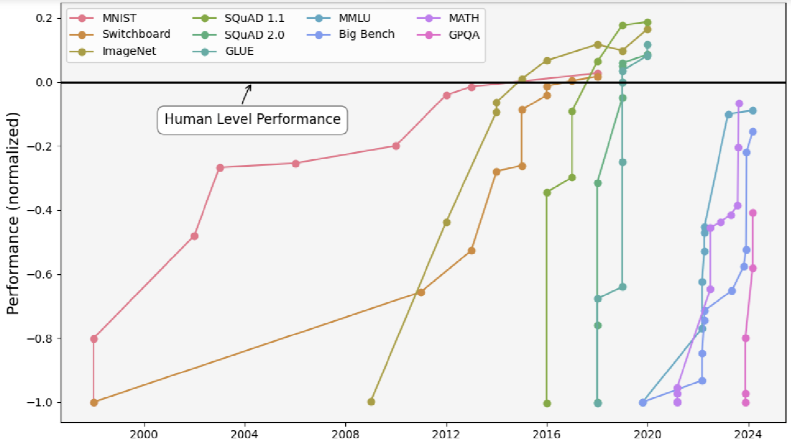

# Brief History of AI

+ "Old-school" ML
    * 1950s-1960s: first neural nets
    * 1970s-1980s: rise of symbolic AI
    * But things seemed bad leading to big AI winter of 1980s/1990s (also
      arguable happened before)
+ Inflection point at 2013 with AlexNet
    * Image recognition
    * Deep Learning revolution

# Characteristics of old school ML

+ Careful tuning of algorithms
+ Feature engineering
+ Scale is not everything, in fact scale is counter-productive
    * Overfitting
+ Thought we were decades, centuries away from AGI

# Overturning of old intuitions in late 2010s

+ Belkin et al.'s 2019 paper demonstrating double descent
    * Just make it bigger! We just hadn't scaled enough!
+ Almost every intuition of "old-school" ML got thrown out
    * Old-school: big models overfit the data
    * Modern: just make the models even bigger and that goes away!
    * Old-school: training too long on the same data overfits that data
    * Modern: just train even longer and that goes away!

# Parameter double descent

.png)

From [here]("https://commons.wikimedia.org/wiki/File:Double_descent_in_a_two-layer_neural_network_(Figure_3a_from_Rocks_et_al._2022).png")

# Scaling Laws

+ More compute leads
+ $L(N, D) = \frac{A}{N^{\alpha}} + \frac{B}{D^{\beta}} + E$
+ DeepMind experiments:
    * $L(N, D) = \frac{406.4}{N^{0.34}} + \frac{410.7}{D^{0.28}} + 1.69$
+ From [here]("https://www.lesswrong.com/posts/6Fpvch8RR29qLEWNH/chinchilla-s-wild-implications")
+ Provides guidance on how best to utilize compute between data and parameter
+ Showed that bottleneck was more data!

# Benchmark saturation

From [here]("https://commons.wikimedia.org/wiki/File:Performance_of_AI_models_on_various_benchmarks_from_1998_to_2024.png")

# Training a modern model

+ Pre-training
    * "Autocomplete"
    * Train a model to have "background knowledge"/"reflexes"/"intuitions"
+ Post-training
    * Make the model actually useful
    * Instruction following
    * Reasoning

# Pretraining breakthrough

+ GPT: Generative Pretrained Transformer
    * Generative: generates text
    * Pretrained: first does a lot of pretraining before training for a specific
      task
    * Transformer: most successful sequence-based architecture to date
+ Pretraining is the first hints of generality
    * Previous AI models were always task-specific
    * Lesson of GPT: training on seemingly irrelevant tasks + some tuning leads
      the model to have better performance on specific tasks than task-specific
      training all the way through
    * Previous assumption was that training on non-specific tasks was "wasted
      training," maybe you get to AGI

# History of models

+ GPT-3
+ InstructGPT
+ Pretraining scaling:
    * GPT-4
    * Claude-3.5
+ Inference time scaling:
    * OpenAI o-series
    * DeepSeek r-1

# Implications of inference time scaling

+ Potentially removing the data bottleneck
+ Incremental scaling (not big-bang training runs)

# Central Question

+ Is scaling all we need (roughly speaking)?
    * Not quite just throw more compute at it
+ Do we have any more breakthroughs left?
    * Everything since GPT has been basically the same thing
    * We keep getting gains

# What happens if we don't have any breakthroughs left?

+ Crazy AI happens very fast

# What happens if we do have some breakthroughs left?

+ Very unpredictable

# What should we expect in 2025

+ Improvements to OpenAI's Operator
    * Computer use
    * Likely still buggy
+ Crazy investment into compute

# Common Misunderstandings

+ What is Mixture of Experts (MoE)
+ Whether AI systems are deterministic
    * They are deterministic
    * Randomness is a post-processing step added because empirically it improves
      performance
+ Context window

# Common Controversies

+ Status of open source/open weight models

# Incentive structures to worry about

+ As models become more powerful, there is less incentive for companies to
  release models
    * Companies derive more benefit
    * Government will likely

# Analyzing company communications

+ Sam Altman's latest blog posts
+ Dario Amodei's latest blog posts
