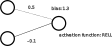
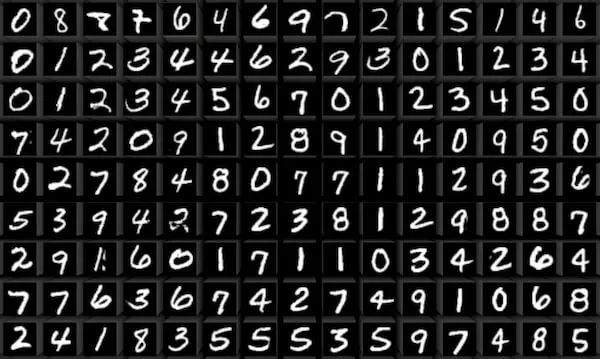

% Intro to Neural Nets

# Neural Nets

+ Loosely inspired by neurons in the brain
+ Small, simple individual structures
+ Pieced together to form complex structures
+ The fundamental part of almost any modern ML/AI structure

# A single neuron (also called node)

+ Weight
    * One weight for each input
    * Lets us capture linear relationships
+ Bias
    * Single bias for whole neuron
    * Lets us capture relationships that don't have a "center point" of exactly 0
+ Activation function
    * Single activation function for *all* neurons
    * Lets us inject non-linearity

# Worked example

Imagine inputs are 1 and 2 respectively.

1. Multiply by weights then add: `1 * 0.5 + 2 * -0.1 = 0.3`
2. Add bias: `0.3 + 1.3 = 1.6`
3. Apply non-linear activation function (RELU = simplest possible non-linear
   function, keep the same if above zero, otherwise clamp to 0): `RELU(1.6) = 1.6`
4. Final output: `1.6`

# Layers

+ Individual neurons (also called nodes) form different layers
+ All neurons in one layer connect to every neuron in the next
+ Input layer (only layer without other neurons feeding in)
+ Output layer (only layer that doesn't feed into other neurons)
+ Every layer in the middle is a "hidden layer"
+ "Deep learning" refers to "deep neural nets," i.e. neural nets with more than
  one hidden layer. Nowadays almost every net is deep.
+ Layers only connect to immediately previous and subsequent layers
    * Can't "skip a layer"
    * Prevents exponential blow up of connections

# Look again at neural net structure

# Notes on structure of a neural net

+ All the "learning" happens in the weights and biases
+ Overall structure of neural net (num of neurons, num of layers, choice of
  activation function, etc.) is fixed

# Why are neural nets so fundamental

+ Neural nets are universal learners
    * Given enough neurons for any function there is an arrangement of weights
      and biases that can approximate it to whatever degree of precision you
      desire
+ Key to universality is the non-linear activation function
    * Everything else in a neural net is linear (since it's all just
      multiplication and addition)
    * If you want to learn non-linear functions you need a source of
      non-linearity!

# Paradigm for producing outputs from a neural network

+ Calculate an output layer-by-layer
    + Iteratively calculate one layer's values and then feed it into the next
    + Going "forward" through the network
+ Known as forward propagation

# Paradigm for learning

+ Have some way of defining the degree of correctness an answer has (loss/error
  function)
+ Run the network over an example input (forward propagate)
+ Compute the loss/error of the network's answer
+ Change weights and biases to reduce the loss/error (known as backpropagation)

# Review neural net diagram

Pause for questions

# Creating a neural net

+ Big piles of floating point numbers
+ It's up to human designers to design and interpret what the input and output "means"

# Example: Digit recognition (MNIST)

+ (Modified) National Institute of Standards and Technology DB
+ Set of handwritten digits, 0-9
+ Want to train a neural net to classify the digits correctly

# Setting up the network: input

+ What should each input node be?
    * Maybe one node for contrast?
    * Another for overall brightness?
+ Let's do the simplest thing possible
    * Every pixel is an input
    * Recurring theme: often the simplest thing works, even if it's big
+ Reminder: this part is designed by the human upfront and not learned by the
  network!

# Setting up the network: output

+ What should each output node be?
    * One output node, with a single number?
    * One output node for each binary digit (so four output nodes)?
    * One output node for every possible category (so ten output nodes)?
+ Reminder: this part is designed by the human upfront and not learned by the
  network!

# Factors for consideration

+ How does this affect our calculation of error?
    * If on one given image that was supposed to be "1" is the answer "7" a
      "worse" answer than "2"? (implied by a single node)
    * Note that this also affects training and learning!
+ How do we interpret the output
    * Single node: The neural net gives us an answer of 3.7. Does that mean the
      neural net "thought" the answer was between a "3" and a "4"? Or between a
      "1" and a "7"?

# Simplicity is again the usual answer

+ We treat every possible category as its own node
+ Total of ten output nodes (0, 1, 2, 3, 4, 5, 6, 7, 8, 9)
+ Nice interpretation where number in each node is "how confident" the neural
  net is in that classification (note that this is a human interpretation! It's
  all just floating point numbers from the neural net point of view)

# Reminder: these are all fixed attributes of the network

+ How many input nodes
+ How many output nodes
+ How many layers
+ Only thing that is learned is the value of weights and biases

# Lot of experimentation

+ How many neurons should we have? How many layers?
    * Some rules of thumb
    * But often answer is "play around and develop intuition"

# Backpropagation

+ We've talked about how to calculate a network output once we know it's weights
  and biases
+ But how do we actually get the weights and biases to be right
+ Again, learning is entirely about "getting the weights and biases right," since that's
  the only thing that changes so backpropagation is essentially synonymous with
  learning

# General paradigm

+ Have some way of defining the degree of correctness an answer has (loss/error
  function)
+ Run the network over an example input (forward propagate)
+ Compute the loss/error of the network's answer
+ *Change weights and biases to reduce the loss/error*

# Changing the weights and biases to reduce loss/error: Gradient descent

+ So far we've been thinking of neural nets as functions from input to output
  with our weights as constants
+ Let's reframe our thinking:
    * Fix the input and output as constants
    * Make our weights a variable
    * Now have a function from weights/biases to error
    * Let's minimize that function

# How to perform minimization

Many candidates

+ Random search (keep sampling different points and keep track of the lowest so
  far)
    * Slow and expensive
+ Find closed-form solution
    * Infeasible for complex, deep networks
+ *Use derivatives to find a negative slope and follow it*
    * More directed than random search
    * Works more broadly than closed-form solutions

# Using derivatives: gradient descent

+ Gradient: n-dimensional derivative
+ Follow the gradient along
    * If it's negative, follow it "forward"
    * If it's positive, follow it "backwards"

# 1-dimensional case

# Multiple dimensions

# Limitations

+ Your loss function must be differentiable (generally not too much of a
  restriction)
+ May only find local minimum

# Batching

+ So far we've been going on an individual example-by-example basis.
+ Potentially a lot of wasted work
    * We find a minimum for one input-output pair
    * Next input-output pair maybe has different minimum, so we throw away all
      the weights from the last time
    * And so on
+ Instead let's combine all our training examples into a single function from
  weights/biases to error
    * Could e.g. calculate error per input-output pair and sum them all together
    * Can also take average (the usual solution)

# If it's universal why do we have different architectures?

+ So many fancy names
    * CNN/RNN/Transformer etc.
+ Why do we need architectures to make neural nets *more* capable?
    * Why do you hear "oh we added X to make it *able* to learn something?"
+ Neural nets by default are *too* flexible
    * Can learn all sorts of spurious relationships
    * Goal misgeneralization

# Neural net architectures represent subtraction, not addition

+ Different architectures represent *constraints* on the default neural net
+ Hopefully:
    * Reduce chance of learning spurious relationships
    * Promote learning "useful" relationships

# Bottom line

+ Any complex stack of neural nets with gizmos and gadgets between them is in
  theory replicable using a single neural net with a particular configuration of
  weights
+ In practice getting the neural net to learn that exact configuration of
  weights is nigh-impossible
+ Hence we revert to a complex stack of neural nets with gizmos and gadgets
+ Can think of this as "freezing" large parts of a global neural net and not
  letting learning change those parts

# Learning vs fine-tuninig

+ Matter of degree
+ During learning we'll have potentially large changes to the neural net
    * Want it to be way different
    * Really unique new examples can cause a neural net to "forget" previous
      training
+ During fine-tuning we want to limit the scope of our changes
    * Don't want the net to forget everything it's already learned!
    * Sometimes accomplished by freezing certain parts of the network and
      exempting them from backpropagation
    * Sometimes accomplished by decreasing size of backpropagation step

# GOFAI and neural nets: Sutter's bitter lesson

+ GOFAI: Good Old-Fashioned AI
    * Expert systems
    * Symbolic reasoning systems
    * Close relationship with Subject Matter Experts (SMEs)
+ Maybe to solve problem of constraints use a human to provide them
    * Feature engineering
+ Bitter lesson (one version): (comparatively) simple architectures dominate aid from human expertise
    * Feature engineering is basically dead (controversial!)
        + We don't have human expert
    * Symbolic reasoning systems (e.g. Cyc) are basically dead (controversial!)
        + ~40 years of work completely outclassed by latest GPT models
    * Increasingly rare to consult SMEs
        + Don't consult translators for tips and tricks on translation to teach
          GPT how to do translation
