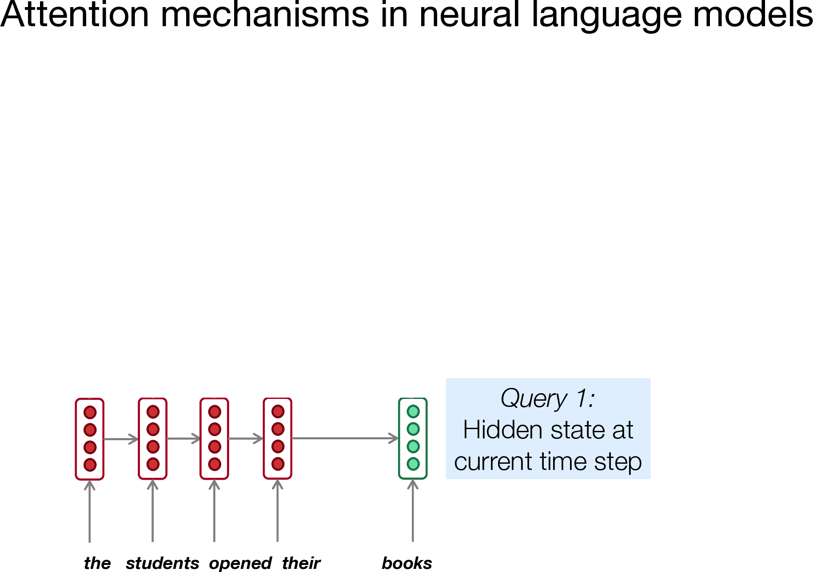
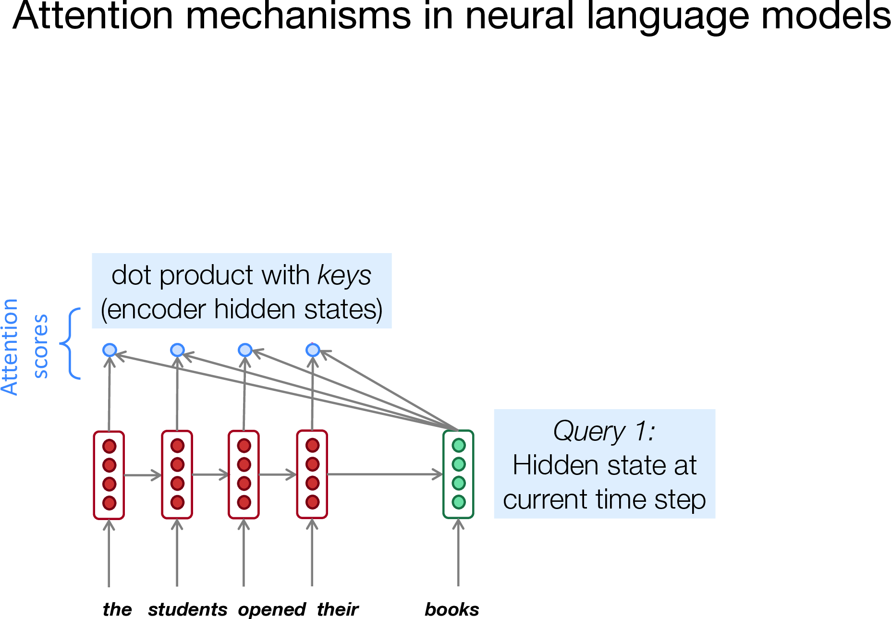
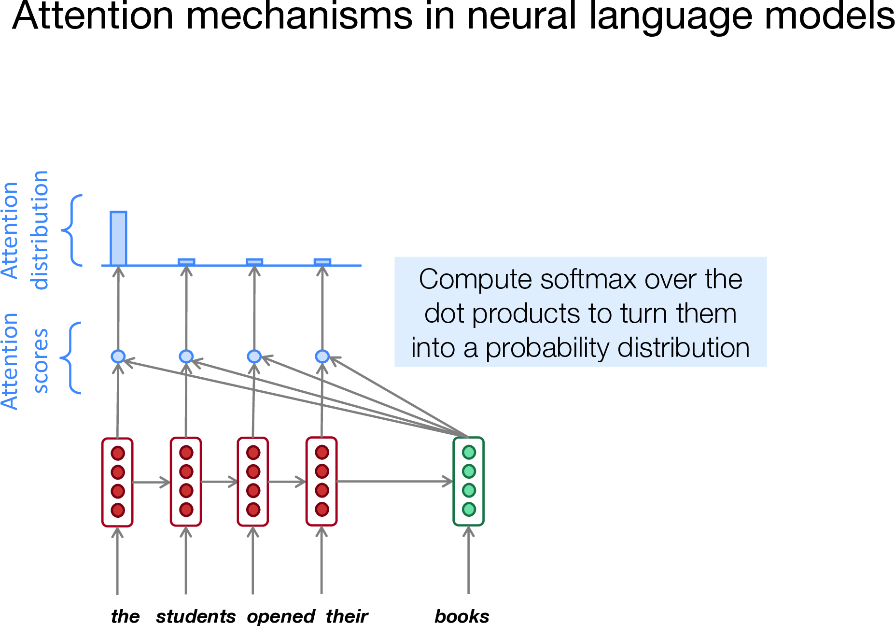
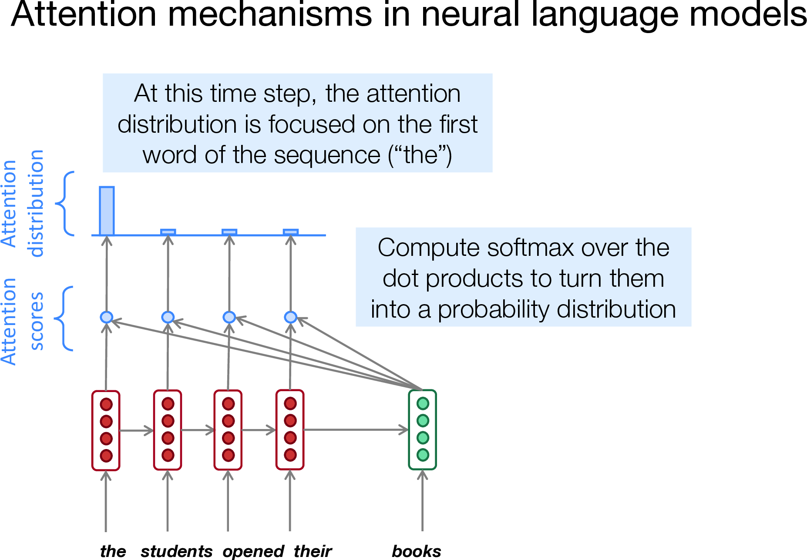
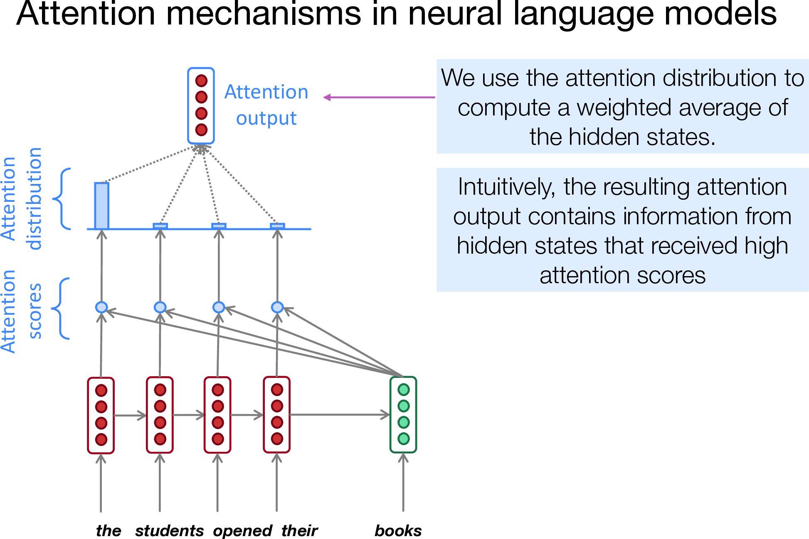
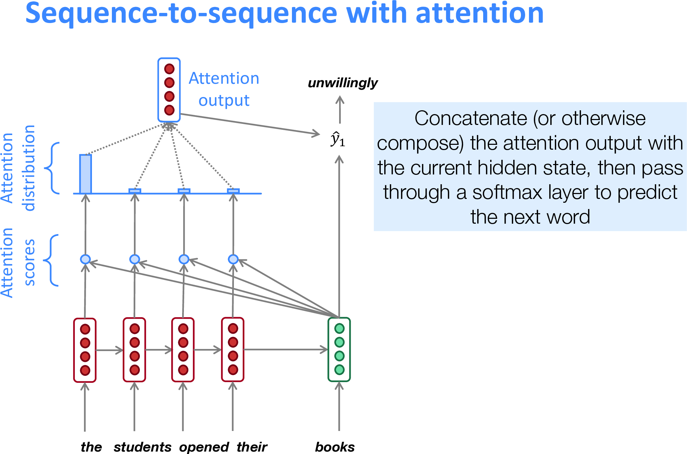
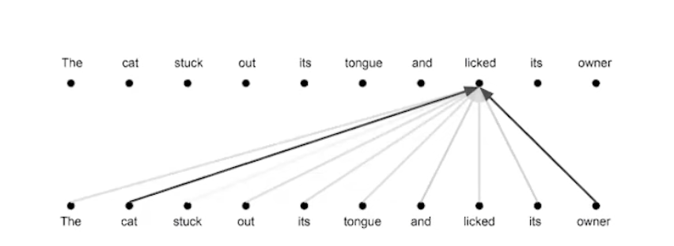
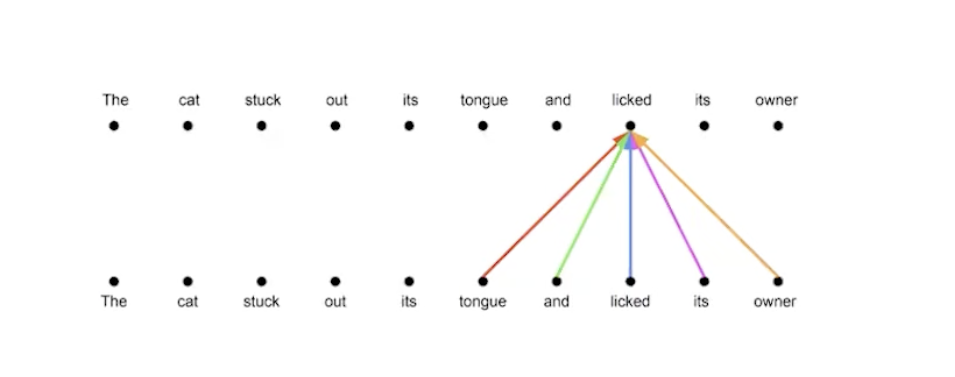
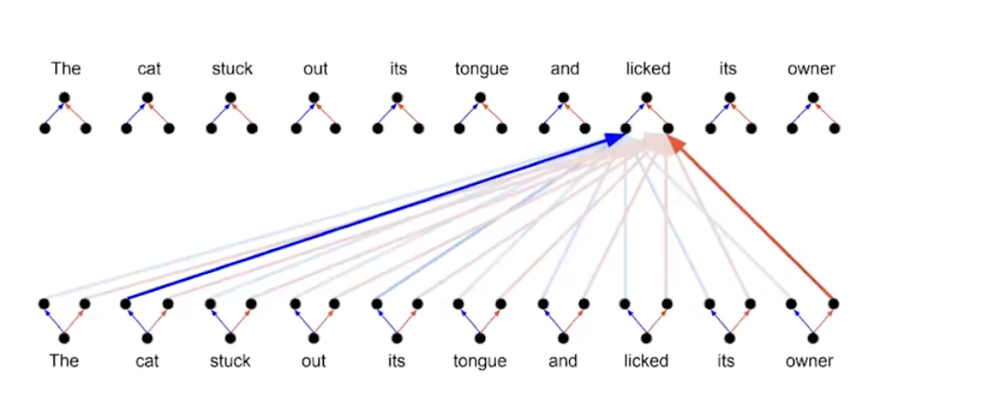

% Transformers Review 

# Transformers Overview
+ "Attention is all you need" (2017)
+ The go-to architecture for most machine learning problems, especially language models

# Brief recap of neural nets


# Brief recap of neural nets (more)

+ Individually simple neurons connected via layers
+ Weights and biases are changed in training
    * Number of neurons and layer structures do not change in training
+ Theoretically universal
    * In practice often learns spurious relationships without more safeguards
    * Architectures provide these safeguards and are therefore **subtractive** not
      **additive**
+ Calculating with weights and biases can be rewritten as matrix multiplication
  and addition
    * Every layer-to-layer connection of weights can be interpreted as a matrix of size n x m
        - n is the size of the previous layer and m is the size of the next layer
        - Entries in matrices are connection weights between two neurons
        - Passing the outputs of one layer as the inputs to the next is
          multiplication of those inputs by the matrix
    * Every set of biases of a layer of neurons can be interpreted as a matrix (with a single column)
        - Each neuron in the layer has one bias entry in the matrix

# Transformers Architecture
::: columns

:::: column
{ height=800px }
::::

:::: column
> **1. Encoder + decoder**

> 2. Attention
> 3. Multi-Head Attention
> 4. Positional Encoding
> 5. Transformer Blocks

::::
:::

# 1. Encoder + decoder
+ Have one neural net (or set of nets) that outputs some abstract representation
  of text
+ Have another neural net (or set of nets) decode that abstract representation
  back to natural language
+ Not new with transformers (e.g. seq2seq 2014)

---

::: columns

:::: column
{ height=800px }
::::

:::: column

> 1. Encoder + decoder

> **2. Attention**

> 3. Multi-Head Attention
> 4. Positional Encoding
> 5. Transformer Blocks

::::
:::

# 2. Attention

+ Inspired by the idea of human attention
+ Allows the model to "attend to" different parts of the input sequence at a given time 
+ NLP Professor Raymond Mooney: *"You can’t cram the meaning of a whole %&!$# sentence into a single $&!#* vector!"*
  * [...you can use your language model of informal English to fill in the masked portions](https://www.cs.utexas.edu/~mooney/cramming.html)
+ Instead, consider attention as a series of queries, keys, and values ($W_k$, $W_q$, $W_v$)
+ Two ways to explore:
    a. [Visual, via Mohit Iyyer, University of Massachusetts Amherst 2021](https://people.cs.umass.edu/~miyyer/cs685_f21/slides/04-attention.pdf)
    b. Analogy from Changlin

# 2a. Attention visualized (Iyyer 2021)
{ height=800px }

# 2a. Attention visualized (Iyyer 2021)
{ height=800px }

# 2a. Attention visualized (Iyyer 2021)
{ height=800px }

# 2a. Attention visualized (Iyyer 2021)
{ height=800px }

# 2a. Attention visualized (Iyyer 2021)
{ height=800px }

# 2a. Attention visualized (Iyyer 2021)
{ height=800px }

# 2b. Attention as a DB query
+ I have a database with keys and values. Keys are chosen to play nicer with
  queries, values are what I actually return in the data.
+ `[("Alice", "some data about Alice"), ("Bob", "some data about Bob")]`
+ Query "Get me data about keys/names that start with 'A'"
+ Match query against key

# 2b. Attention as a DB query
::: columns

:::: column
+ **Abstract steps of DB query**
+ Split data into keys and values
+ Generate a query
+ Compare queries with keys
+ Use comparison to select which values to return
::::

:::: column
+ **What about a "fuzzy" DB query?**
+ Split data into keys and values
+ Generate a query
+ Instead of binary comparison, yes/no, do a fuzzy match score between 0 and 1
+ Multiply each value by the fuzzy match and combine them all together to return
  a "fuzzy" match
+ This degenerates to a normal DB query if we just constrain the fuzziness to
  either 0 or 1
::::
:::

# 2b. Attention: Equivalents in attention
+ Generate a key and value vector from a given word
+ Generate a query vector from the word
+ Dot product the query vector against the key vector to generate weights
+ Multiply each value vector by the weights

# 2b. Attention: Generating the key, value, and query vectors

+ We have matrices for each key, value, and query
    * $W_k$, $W_v$, and $W_q$
+ These matrix values are learned during training

# 2b. Attention: Working through a specific example
+ "The car was driving too quickly through the field. *It* crashed into a tree."
+ Look at a single given word "it", which has some vector form after embedding
+ Multiply *every word*'s embedding by $W_k$ to generate key vectors for all of
  them
+ Multiply *every word*'s embedding by $W_v$ to generate value vectors for all
  of them
+ Multiply "it" embedding by $W_q$ to generate a single query vector
+ Dot product query vector against every key vector to get weights against every
  value
+ Multiply every value by weight and add them altogether to the final attention
  result
+ 

---

::: columns

:::: column
{ height=800px }
::::

:::: column

> 1. Encoder + decoder
> 2. Attention

> **3. Multi-Head Attention**

> 4. Positional Encoding
> 5. Transformer Blocks

::::
:::

# 3. Multi-Head Attention
+ Empirical tuning (like so much of ML!) 
+ The entirety of the reasoning in the original paper: "We found it beneficial"
  [the original paper](https://arxiv.org/pdf/1706.03762.pdf)

# 3. Attention is relatively unexpressive (Vaswani 2024)
+ 
+ 

# 3. Multi-Head Attention increases expressivity (Vaswani 2024)



# 
::: columns

:::: column
{ height=800px }
::::

:::: column

> 1. Encoder + decoder
> 2. Attention
> 3. Multi-Head Attention

> **4. Positional Encoding**

> 5. Transformer Blocks

::::
:::

# 4. Positional Encoding

+ Attention is position invariant, as is almost everything in a transformer block
+ It is therefore common to explicitly encode position information
+ This is called a *positional encoding*, where after embedding a token as a vector of floats, there is another operation that modifies the vector based on what the
  index of the token is in the input

# 
::: columns

:::: column
{ height=800px }
::::

:::: column

> 1. Encoder + decoder
> 2. Attention
> 3. Multi-Head Attention
> 4. Positional Encoding

> **5. Transformer Blocks**

::::
:::

# 5. Transformer blocks
+ A transformer model consists of all of the components we've discussed, but some of them are repeated in structures called "blocks" 

+ Remember MLP is just a vanilla neural net.
```
----------------------------
|      Output              |
|        ^                 |
|        |                 |
|   Normalization <-----|  |
|        ^              |  |
|        |              |  |
|       MLP             |  |
|        ^              |  |
|        | -------------|  |
|        |                 |
|   Normalization <-----|  |
|        ^              |  |
|        |              |  |
| Multi-Head Attention  |  |
|        ^              |  |
|        |              |  |
|      Input -----------|  |
|                          |
----------------------------
```


# 5. Stacking attention on top of attention
+ Keep stacking attention matrices on top of rounds of merging multiple
  attention streams
+ Query, key, value intuition kind of falls apart
    * What is attention "*really*"?
    * At the end of the day a particular set of guardrails on neural nets that
      seems to make models good at language
    * Again no reason in theory why a sufficiently large single neural net
      couldn't subsume the idea of attention
        - It just doesn't happen in practice
        - Too many spurious relationships
        - The guardrails provided by attention cut down on spurious
          relationships (i.e. subtractive, not additive new capabilities)

# Putting It All Together
1. Start with an input text sequence consisting of `n` tokens
2. Convert that to `n` vectors of size `d_model` using some pretrained
   embedding (will use `n` x `d_model` as short-hand for this)
3. Add positional encoding: output is new set of `n` x `d_model` vectors
4. Pass into (multi-head) attention mechanism: output is new set of `n` x `d_model` vectors
5. Normalize the sum of input into attention and its output from the previous
   step: output is new set of `n` x `d_model` vectors
6. Pass vectors into MLP: output is new set of `n` x `d_model` vectors
7. Normalize the sum of input into MLP and its output from the previous step:
   output is new set of `n` x `d_model` vectors
8. Repeat steps 4-7 for as many transformer blocks as the model has: output is
   new set of `n` x `d_model` vectors
9. Pass into final linear layer: output is new set of `n` x `d_vocabulary`
   vectors (`d_vocabulary` is the number of possible distinct tokens)
10. Choose the last vector: output is `1` x `d_vocabulary` vector
11. Choose index of vector with highest scalar value: output is `1` scalar
12. Lookup that index using vocabulary dictionary back to a text token: output is a single new token

